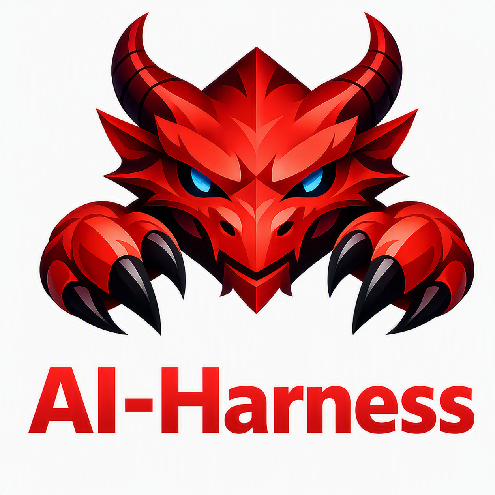

<h3 align="center">
AI-Harness：基于 OpenClaw 的端云混合大模型调用框架
</h3>

<p align="center">
  
</p>

<p align="center">
    【中文 | <a href="./README.md"><b>English</b></a>】
</p>

## 概述

**AI-Harness** 是在 **OpenClaw** 基础上构建的项目，旨在支持混合端‑云大模型调用。它通过无缝集成本地（边缘）模型与远程（云）服务，使得在多种部署场景下能够灵活、高效地使用大型模型。

## 为什么选择 AI-Harness
更好地适配 WoS 平台，解决本地部署、隐私保护、智能上下文压缩、负载感知的模型路由、面向特定场景的端侧 Agent 以及混合 Agent 编排等核心挑战。

## 功能列表

每项功能均由 [`extensions/`](extensions) 目录下的一个专用 OpenClaw 插件提供：

| 功能 | 插件 | 说明 |
| --- | --- | --- |
| 隐私保护 | [guardclaw](extensions/guardclaw) | 在多个检查点检测敏感内容（S1/S2/S3），并将 S3 级操作路由到隔离的、使用本地模型的 guard agent，确保私密数据不离开本机。 |
| 智能上下文压缩 | [context-trim](extensions/context-trim) | 为低上下文的本地/边缘模型（16K 以下）用精简版 `minimal` 系统提示替换默认系统提示，把更多的上下文预算留给实际任务。 |
| 负载感知的模型路由 | [dragon-router](extensions/dragon-router) | 检测每条 prompt 的隐私级别和任务复杂度，并据此在多个模型层级间路由——敏感数据留在本地，中等敏感数据在上云前先脱敏。 |
| 面向特定场景的端侧 Agent | [video-chapters](extensions/video-chapters) *(示例)* | 一种构建专注于单一任务的本地 AI 工具的模式——例如完全在本地对视频进行索引和语义搜索的 video-chapters。 |
| 混合 Agent 编排 | [dragon-task-orchestrator](extensions/dragon-task-orchestrator) | 将一个复合请求拆分为多个子任务，分别路由给匹配的 agent（动态拆解或固定流水线执行），最后汇总为一条回复。 |

## 安装

与 OpenClaw 保持一致：

### 1. 克隆仓库
```bash
https://github.com/qualcomm/AI-Harness.git
cd AI-Harness
```

### 2. 安装依赖 + 构建

```bash
pnpm install
pnpm build
pnpm ui:build
pnpm openclaw onboard // 向导配置 openclaw
pnpm openclaw gateway run --verbose // 启动网关
```
